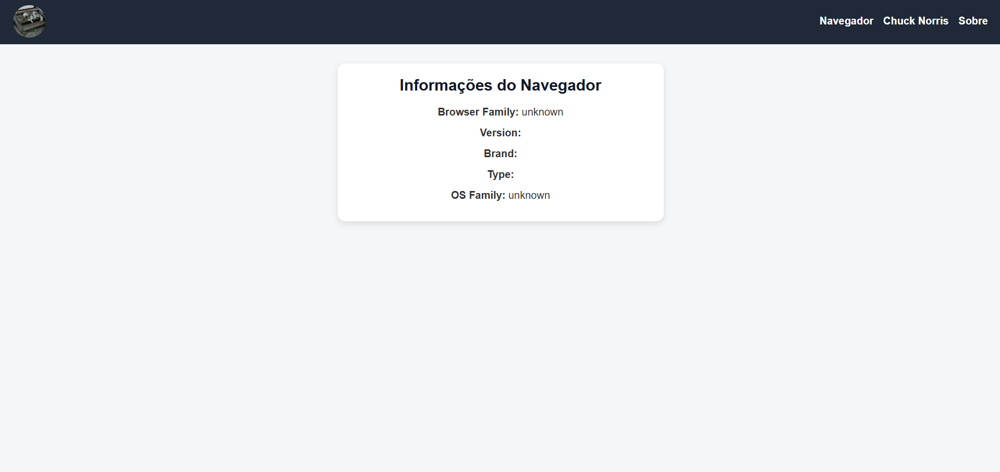
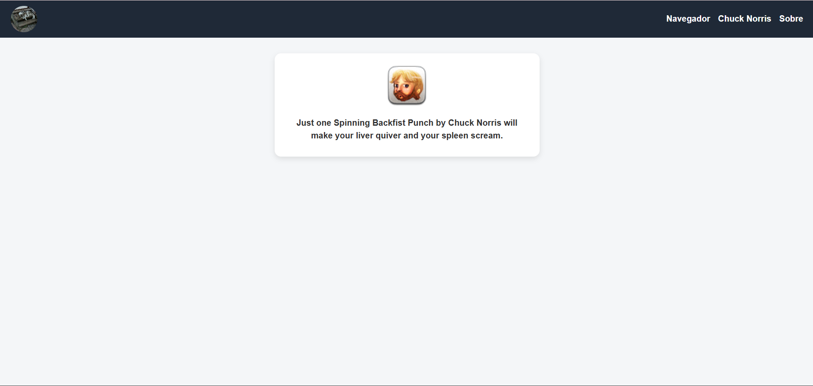

# react_chucknorris

Aplicação web desenvolvida em **React + Vite** como atividade prática da disciplina **Frontend Frameworks**.

O projeto consome **três APIs públicas**, exibindo informações de forma organizada em diferentes telas, com navegação entre páginas e um menu superior fixo.

---

## 🎯 Objetivo do Projeto

Desenvolver uma aplicação React utilizando Vite com foco em:
- Consumo de APIs REST públicas
- Organização de componentes
- Navegação entre telas
- Boas práticas de versionamento com GitHub

---

## 🧩 Funcionalidades

- 🐱 Avatar dinâmico de gato no menu superior
- 🌐 Exibição de informações do navegador do usuário
- 😂 Frase aleatória do Chuck Norris
- 👤 Tela Sobre com informações do desenvolvedor

---

## 🔌 APIs Utilizadas

- **Cataas (Avatar do Gato)**  
  https://cataas.com/cat

- **CAgent (Informações do Navegador)**  
  https://www.apicagent.com/

- **Chuck Norris API**  
  https://api.chucknorris.io/jokes/random

---

## 🛠️ Tecnologias Utilizadas

- React
- Vite
- JavaScript
- HTML5
- CSS3
- React Router DOM
- Git e GitHub

---

## ▶️ Como executar o projeto localmente

### Pré-requisitos:
- Node.js versão 20.x
- Git

## 🖼️ Prints da Aplicação

### Tela – Informações do Navegador


### Tela – Chuck Norris



### Passos:

```bash
git clone https://github.com/mariacarolinaferreira/react_chucknorris.git
cd react_chucknorris
npm install
npm run dev
